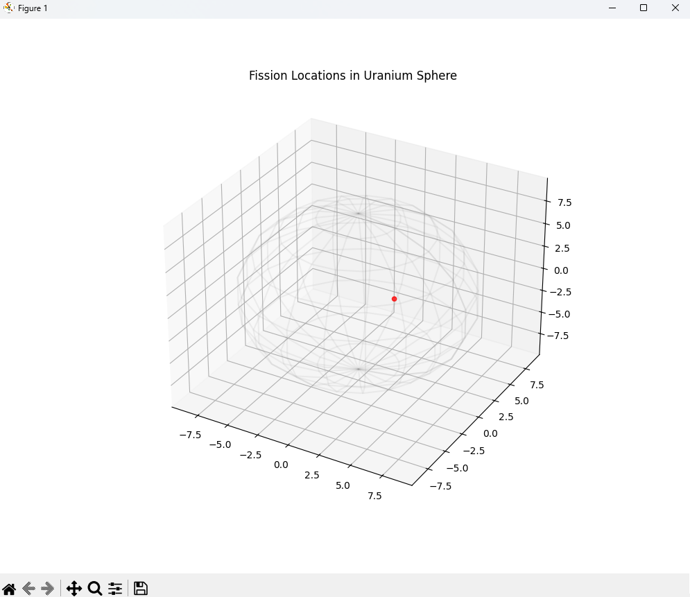

## Monte Carlo Neutron Transport Simulator (MCNTS)

## The Idea​
This project is a high-performance C++ physics simulation designed to model the stochastic behavior of fast neutrons within a fissile mass. Using Monte Carlo methods, the simulation tracks individual neutron life cycles—from emission to either capture, escape, or fission—to determine the criticality (k-factor) of a given geometric arrangement of Uranium-235.

## ​Where it Came From​
The inspiration for this project stems from reading Richard Rhodes’ The Making of the Atomic Bomb.​Rhodes meticulously details the transition from theoretical physics to the computational challenges faced by the "human computers" and early mechanical integrators at Los Alamos. This project is an attempt to recreate those foundational calculations using modern computational power, transitioning from Python prototypes to a high-speed C++ implementation to handle the exponential scaling of a supercritical chain reaction.

## ​Where it Came From​
​The primary goal of this repository is educational exploration. It serves as a practical application of several key concepts: - ​Stochastic Modeling: Using probability distributions (specifically the Mean Free Path and Poisson distributions) to simulate random physical events. -​High-Performance C++: Managing memory and execution speed as particle counts grow exponentially. -

## Nuclear Physics Fundamentals: ​
Understanding the relationship between density, cross-section (\sigma),
and the "critical mass" required for a sustained reaction.

## Technical Implementation:
1) Language: C++17/20
2) Algorithm: Monte Carlo Neutron Transport
## Physics Constants:
1) ρ (Density): 19.1 g/cm³ (U-235)
2) σ (Cross Section): ~1.2 barns (Fast Fission)
3) λ (Mean Free Path): ~17.3 cm
-- Key Logic: The simulation uses a logarithmic transformation of random variables to determine travel distance: d = -λ ln(R)

## Technical Implementation:
1) ​[ ] Implement Multi-threading (OpenMP) to handle 10^7+ neutrons,
2) ​[ ] Add Reflector Geometry (simulating a Beryllium "tamper" to bounce neutrons back),
3) ​[ ] Export data to .csv for visualization in Python/Matplotlib.
